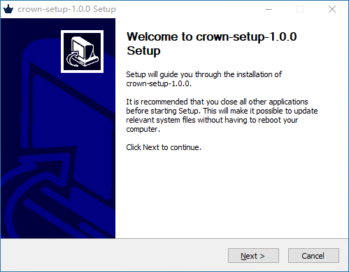
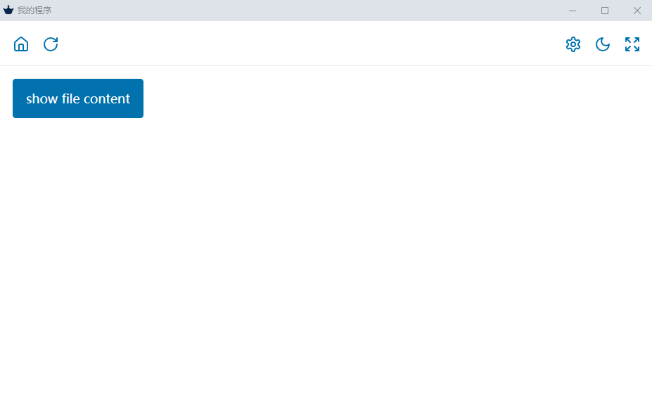

# Crown

- 这是一个程序模板
- 使用 Web 技术栈开发 Windows GUI 程序
- 运行时为 Chrome
  - 开启本地文件连接 `--allow-file-access-from-files`
  - 开启APP模式 `--app`
- 基于 Windows 打包
  - 使用 NSIS 打包为 Windows exe 安装包

特点：

- 不能跨平台，但是安装包超级小
- 有 Chrome 的 Windows 电脑就能安装运行

## 注意

Chrome 开启了 `--allow-file-access-from-files`, 安装包安装完毕后，重启所有的 Chrome 窗口后才能生效。

## 界面





## 开发者

- 打包发行需要安装 NSIS，得到 `nsis` `makensis` 命令
- NSIS 好像不能自动生成 dist 目录，如果没有 dist 目录在打包时会报错 `Can't open output file`。

```shell
# 开发模式
yarn dev

# 打包发行
yarn build
```
